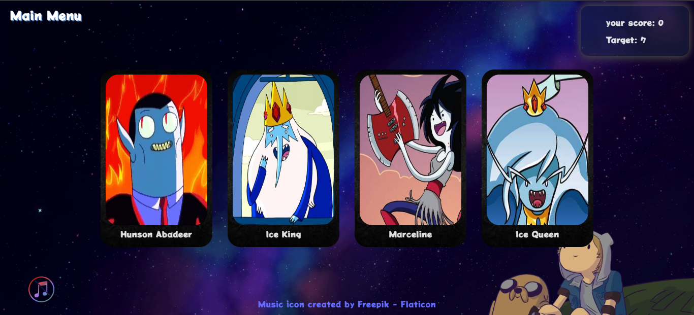

<h1 align ='center'>Memory Game </h1>



the memory game is a fun game to test your memory. done as a part of [The Odin Project](https://www.theodinproject.com/) curriculum

## Live Preview

[Live Demo](https://khaledmemorygame.netlify.app/)

## Built with

* [React](https://reactjs.org/) - JavaScript library for building user interfaces.
* [CSS Modules](https://github.com/css-modules/css-modules) - For styling components with locally scoped CSS in React applications.

## features

* User-friendly navigation
* Smooth and fun animations
* difficulty levels

## Installation

#### Here are the instructions if you want to work on the proejct locally

1. Clone the repository.

```sh
HTTPS - $ git clone https://github.com/Khaled0P/Memory-game.git
or
SSH - $ git@github.com:Khaled0P/Memory-game.git
```

2. Move to the cloned directory.

```sh
cd Memory-game
```

3. Install the dependencies.

```sh
$ npm i
or
$ yarn
```

4. Start the project.

```sh
$ npm start
or
$ yarn start
```
